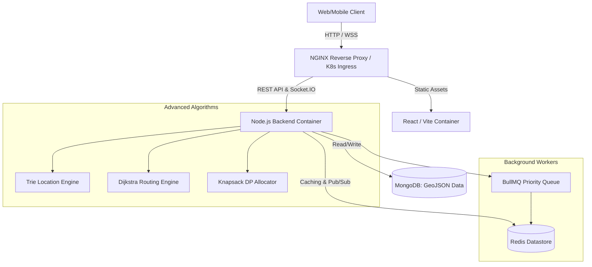

# 🏛️ System Architecture

This application follows a highly decoupled **Clean Architecture** combined with an event-driven realtime engine. 

## Infrastructure Diagram

```mermaid
graph TD
    Client[Web/Mobile Client] -->|HTTP / WSS| Ingress[NGINX Reverse Proxy / K8s Ingress]
    
    Ingress -->|Static Assets| Frontend[React / Vite Container]
    Ingress -->|REST API & Socket.IO| Backend[Node.js Backend Container]
    
    Backend -->|Read/Write| DB[(MongoDB: GeoJSON Data)]
    Backend -->|Caching & Pub/Sub| Redis[(Redis Datastore)]
    
    subgraph Advanced Algorithms
        Backend --> Trie[Trie Location Engine]
        Backend --> Graph[Dijkstra Routing Engine]
        Backend --> DP[Knapsack DP Allocator]
    end
    
    subgraph Background Workers
        Backend --> BullMQ[BullMQ Priority Queue]
        BullMQ --> Redis
    end
```
