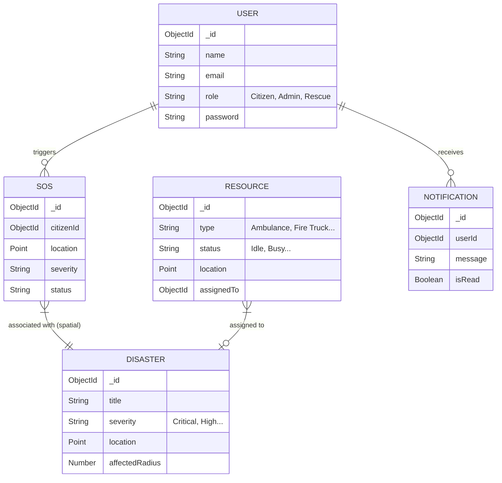

# 🗄️ Entity-Relationship Diagram

```mermaid
erDiagram
    USER {
        ObjectId _id
        String name
        String email
        String role "Citizen, Admin, Rescue"
        String password
    }
    
    DISASTER {
        ObjectId _id
        String title
        String severity "Critical, High..."
        Point location
        Number affectedRadius
    }
    
    SOS {
        ObjectId _id
        ObjectId citizenId
        Point location
        String severity
        String status
    }
    
    RESOURCE {
        ObjectId _id
        String type "Ambulance, Fire Truck..."
        String status "Idle, Busy..."
        Point location
        ObjectId assignedTo
    }
    
    NOTIFICATION {
        ObjectId _id
        ObjectId userId
        String message
        Boolean isRead
    }

    USER ||--o{ SOS : triggers
    USER ||--o{ NOTIFICATION : receives
    SOS }|--|| DISASTER : "associated with (spatial)"
    RESOURCE }|--o| DISASTER : "assigned to"
```
