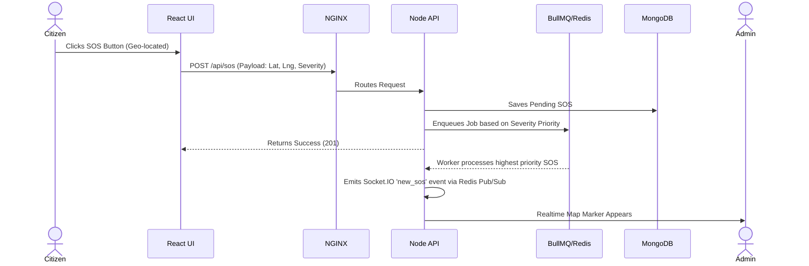

# 🔄 Sequence Diagrams

## Priority SOS Trigger & Realtime Assignment

```mermaid
sequenceDiagram
    actor Citizen
    participant React UI
    participant NGINX
    participant Node API
    participant BullMQ/Redis
    participant MongoDB
    actor Admin

    Citizen->>React UI: Clicks SOS Button (Geo-located)
    React UI->>NGINX: POST /api/sos (Payload: Lat, Lng, Severity)
    NGINX->>Node API: Routes Request
    Node API->>MongoDB: Saves Pending SOS
    Node API->>BullMQ/Redis: Enqueues Job based on Severity Priority
    Node API-->>React UI: Returns Success (201)
    
    BullMQ/Redis-->>Node API: Worker processes highest priority SOS
    Node API->>Node API: Emits Socket.IO 'new_sos' event via Redis Pub/Sub
    Node API->>Admin: Realtime Map Marker Appears
```
